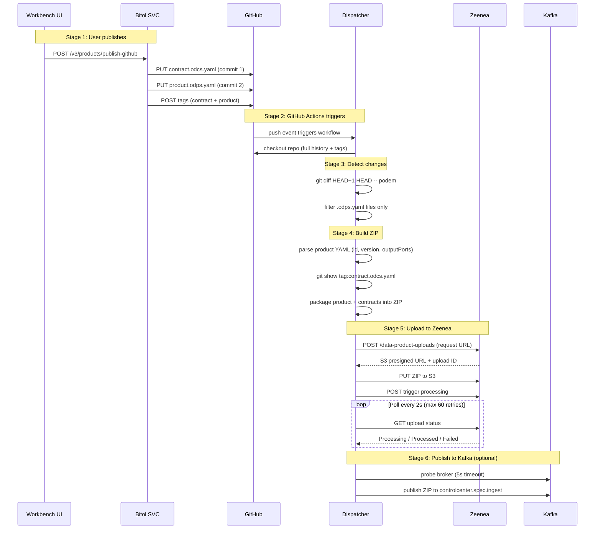

# Dispatcher

A Java CLI tool (formerly "Data Product Uploader") that uploads [ODPS](https://opendataproductspecification.com/) data product descriptors to the [Actian Data Intelligence Platform](https://www.actian.com/) (Zeenea) via its Data Product API. Optionally, it also publishes spec ZIPs to a Kafka topic for ingestion by the [Data Product Control Center](https://github.com/jgperrin/ai.jgp.dataproduct.controlcenter.svc). It can be used standalone or as part of a GitHub Actions workflow.

## End-to-End Process

The dispatcher is the final stage in a pipeline that moves data product specs from the Bitol Workbench to downstream systems (Zeenea catalog, Control Center). Understanding the full pipeline is essential.

### Stage 1: User publishes from the Workbench

The user clicks "Publish to GitHub" in the Workbench web app (or calls the API directly). The Bitol service (`ai.jgp.bitol.svc`) handles the publish:

1. **V3 enhanced publish** (`POST /v3/products/publish-github`):
   - Runs pre-publish checks on the product and all its referenced contracts (version conflict detection via git tags).
   - Publishes each referenced contract to the GitHub repo via `PUT /repos/{owner}/{repo}/contents/{path}` (one commit per contract).
   - Publishes the product itself (one more commit).
   - Creates/updates git tags for each published artifact (format: `product-{id}-v{version}`, `contract-{id}-v{version}`).
   - Files are placed in the path specified by the product's `canonicalUrl` (e.g., `podem/04acb87d-....odps.yaml` on the `dev` branch).

2. **V1 publish** (`POST /v1/products/publish-github`): Publishes a single product file with no pre-publish checks and no auto-publish of contracts.

> **Known limitation (TD-19):** Each file is a separate commit. Publishing a product with N contracts creates N+1 commits, triggering N+1 GitHub Actions runs. Only the run triggered by the `.odps.yaml` commit does useful work. See `doc/TECH-DEBT.md` in `ai.jgp.bitol.svc`.

### Stage 2: GitHub Actions triggers the dispatcher

The workflow file (`.github/workflows/upload-data-products.yml`) triggers on:
- **Push** to `main` or `dev` branches when files matching `podem/**/*.odps.yaml` or `podem/**/*.odcs.yaml` change.
- **Manual dispatch** (`workflow_dispatch`) from the GitHub UI or the Workbench.

The workflow:
1. Checks out the user's repository with full history and tags (`fetch-depth: 0`, `fetch-tags: true`).
2. Checks out the dispatcher repo (`jgperrin/ai.jgp.dispatcher`) and builds it.
3. Runs: `java -jar data-product-uploader-*.jar --dir podem`

### Stage 3: Dispatcher detects changed products (directory mode)

When invoked with `--dir`, the dispatcher uses `git diff` to find what changed:

```
git diff --name-only HEAD~1 HEAD -- podem
```

This compares the **last commit** against its parent. From the list of changed files:
- Files ending in `.odps.yaml` are selected as **products to process**.
- Files ending in `.odcs.yaml` are logged but **not processed directly** (contracts are bundled with their parent product).

If no `.odps.yaml` files changed, the dispatcher exits with: `No product files changed, nothing to upload.`

### Stage 4: ZIP building (per product)

For each changed product, `ZipBuilder.buildFromProduct()` creates a versioned ZIP:

1. **Parse the product YAML** to extract `id`, `version`, and `outputPorts[]`.
2. **Add the product** to the ZIP as `{productId}-v{version}.odps.yaml`.
3. **Resolve referenced contracts** from each output port:
   - Extract `contractId` and `version` from the port.
   - Try `git show contract-{contractId}-v{version}:podem/{contractId}.odcs.yaml` to get the contract content at the exact tagged version.
   - If the tag doesn't exist, fall back to the current file on disk.
   - If neither exists, skip with a warning.
   - Add to ZIP as `{contractId}-v{version}.odcs.yaml`.

The ZIP contains the product and all its referenced contracts at their correct versions.

### Stage 5: Upload to Zeenea

The `ZeeneaClient` uploads the ZIP:

1. **Request upload URL** — `POST /api/synchronization/data-product-uploads` with `X-API-SECRET` header. Returns an S3 presigned URL and upload ID.
2. **Upload ZIP** — `PUT` the ZIP to the S3 URL with KMS encryption headers.
3. **Trigger processing** — `POST /api/synchronization/data-product-uploads/{uploadId}/trigger` with catalog code.
4. **Poll for status** — `GET /api/synchronization/data-product-uploads/{uploadId}` every 2 seconds (up to 60 retries). Waits until status is `Processed` or `Failed`.

### Stage 6: Publish ZIP to Kafka (optional)

If Kafka credentials are configured (`KAFKA_BROKER_URL`, `KAFKA_USERNAME`, `KAFKA_PASSWORD`):

1. **Probe broker** — attempt connection with a 5-second timeout.
2. **Auto-trust SSL** — if SASL_SSL, try to fetch and trust the broker's certificate.
3. **Publish** — send the entire ZIP as a binary message to the `controlcenter.spec.ingest` topic with the ZIP filename as the message key.

The Control Center receives the ZIP, extracts the specs, and transitions data products to `SPEC_READY` status.

If the broker is unreachable, Kafka publishing is skipped with a warning (the Zeenea upload still counts as success).

### Process diagram



## Two Operating Modes

### Directory mode (`--dir`)

Used by GitHub Actions. Detects changed `.odps.yaml` files via `git diff`, builds a ZIP per product, uploads each.

```bash
java -jar target/data-product-uploader-*.jar --dir podem
```

### File mode (`--file`)

Used standalone. Takes a pre-built ZIP or a single `.odps.yaml` file.

```bash
# Pre-built ZIP
java -jar target/data-product-uploader-*.jar \
  --file data-products.zip \
  --tenant my-company \
  --api-key YOUR_API_KEY

# Single product YAML (auto-builds ZIP with referenced contracts)
java -jar target/data-product-uploader-*.jar \
  --file podem/my-product.odps.yaml \
  --tenant my-company \
  --api-key YOUR_API_KEY
```

With Kafka publishing enabled:

```bash
java -jar target/data-product-uploader-*.jar \
  --file data-products.zip \
  --tenant my-company \
  --api-key YOUR_API_KEY \
  --kafka-broker api.jgp.ai:9093 \
  --kafka-user YOUR_KAFKA_USER \
  --kafka-password YOUR_KAFKA_PASSWORD
```

Or use the convenience wrapper (auto-builds if needed):

```bash
./bin/upload.sh --file data-products.zip --tenant my-company --api-key YOUR_API_KEY
```

## Requirements

- Java 21 or later
- Maven 3.8+ (to build from source)

## Build

```bash
mvn clean package
```

## CLI Flags

### Zeenea (required)

| Flag        | Env Variable     | Required | Default   | Description                                                    |
|-------------|------------------|----------|-----------|----------------------------------------------------------------|
| `--file`    | `ZEENEA_FILE`    | Yes*     | -         | Path to the ZIP or `.odps.yaml` file                           |
| `--dir`     | `ZEENEA_DIR`     | Yes*     | -         | Directory to scan for changed `.odps.yaml` files (e.g. `podem`)|
| `--tenant`  | `ZEENEA_TENANT`  | Yes**    | -         | Zeenea tenant name (builds URL `https://{tenant}.zeenea.app`)  |
| `--api-key` | `ZEENEA_API_KEY` | Yes      | -         | Platform API key (`X-API-SECRET`)                              |
| `--catalog` | `ZEENEA_CATALOG` | No       | `default` | Target catalog code                                            |
| `--url`     | `ZEENEA_URL`     | No       | -         | Custom base URL (overrides tenant-based URL)                   |

*\*Either `--file` or `--dir` is required (mutually exclusive).*
*\*\*Not required if `--url` is provided.*

### Kafka (optional)

When configured, the dispatcher publishes the ZIP as a binary message to the `controlcenter.spec.ingest` Kafka topic after a successful Zeenea upload. If no broker is provided, Kafka publishing is silently skipped.

| Flag               | Env Variable       | Required | Default | Description                                |
|--------------------|--------------------|---------|---------|--------------------------------------------|
| `--kafka-broker`   | `KAFKA_BROKER_URL` | No      | -       | Kafka broker URL (e.g. `api.jgp.ai:9093`)  |
| `--kafka-user`     | `KAFKA_USERNAME`   | No      | -       | SASL username for Kafka authentication     |
| `--kafka-password` | `KAFKA_PASSWORD`   | No      | -       | SASL password for Kafka authentication     |

The Kafka producer uses **SASL_SSL** with **SCRAM-SHA-512** and expects a truststore at `~/.kafka/kafka.client.truststore.jks`. If no credentials are provided (broker only), it falls back to PLAINTEXT.

### General

| Flag              | Env Variable | Required | Default | Description          |
|-------------------|--------------|----------|---------|----------------------|
| `--debug`         | -            | No       | Off     | Enable debug logging |
| `--version`, `-v` | -            | No       | -       | Show version         |
| `--help`, `-h`    | -            | No       | -       | Show usage help      |

CLI flags take precedence over environment variables.

## GitHub Actions Integration

This tool can be set up as a GitHub Actions workflow to automatically upload data products whenever `.odps.yaml` files are pushed to `main` or `dev`. See [GITHUB_ACTION_SETUP.md](GITHUB_ACTION_SETUP.md) for a step-by-step guide.

The Workbench can also install the workflow automatically via the Settings page (`POST /v3/github/workflow`).

## Example Output

```
Data Product Uploader v0.4.0

Running: git diff --name-only HEAD~1 HEAD -- podem
git diff exit code: 0, files changed in podem: 1
  changed: podem/04acb87d-7cb5-34bb-9e1b-15eeec6109ea.odps.yaml
Product files to process: 1
Changed product files:
  podem/04acb87d-7cb5-34bb-9e1b-15eeec6109ea.odps.yaml

==========================================
Processing: podem/04acb87d-7cb5-34bb-9e1b-15eeec6109ea.odps.yaml
==========================================
Building versioned ZIP for product: 04acb87d-7cb5-34bb-9e1b-15eeec6109ea v1.0.0
  + 04acb87d-7cb5-34bb-9e1b-15eeec6109ea-v1.0.0.odps.yaml
  + 43afeb0e-7744-37f4-8eaf-1e948eb8aa1a-v0.1.1.odcs.yaml (from output port 'Default Data Product Output Port', tag: contract-43afeb0e-...-v0.1.1)

[1/4] Requesting upload URL...
       Upload ID: ade13015-2063-414a-9e22-a59a014b2432
       Max file size: 50 MB
[2/4] Uploading ZIP file...
       Upload complete.
[3/4] Triggering processing (catalog: default)...
       Processing triggered.
[4/4] Polling for processing status...
       Attempt 1/60 — status: Processing
       Attempt 2/60 — status: Processed

Processing complete:
  Descriptors processed: 1
  Data products upserted: 1

Publishing ZIP to Kafka...
  Published: data-products-xxxxx.zip (12345 bytes)

Summary: 1 succeeded, 0 failed (out of 1 products)
```

## Related Projects

| Project | Repo | Description |
|---------|------|-------------|
| **Bitol Services** | `ai.jgp.bitol.svc` | Spring Boot REST API — publishes specs to GitHub, triggers this dispatcher |
| **Workbench Web App** | `ai.jgp.workbench.webapp` | React/Vite UI where users edit and publish contracts/products |
| **Control Center Services** | `ai.jgp.controlcenter.svc` | Receives specs from Kafka, manages data product lifecycle |
| **Data Product Sidecar** | `ai.jgp.dataproduct.sidecar` | Agent co-deployed with data products, reports health metrics |

## License

This project is licensed under the Apache License 2.0 - see the [LICENSE](LICENSE) file for details.
